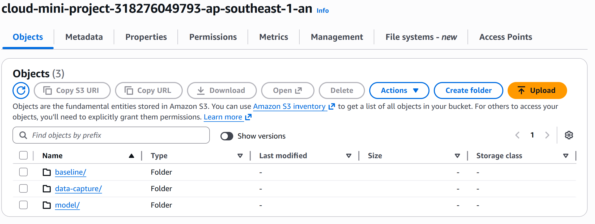
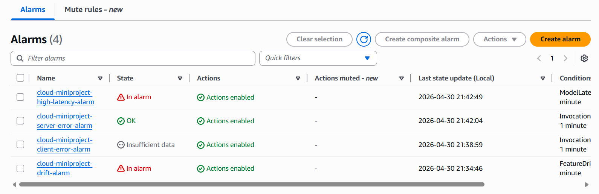
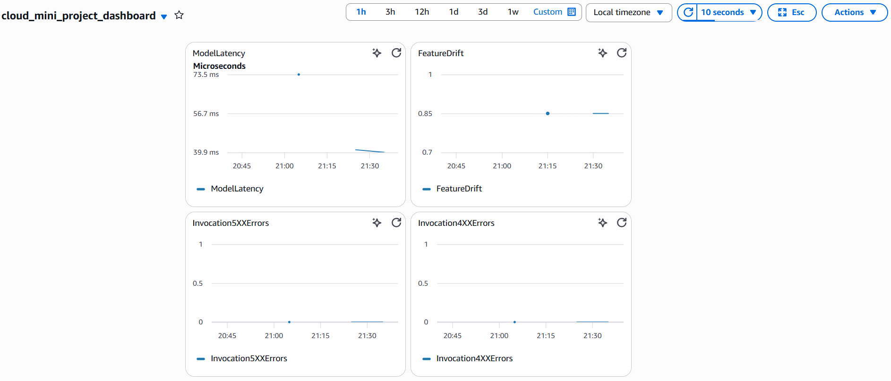

# First setup
```bash
make venv
make install
make activate
```

```cmd
python -m script.preprocess
python -m script.extract_features
python -m script.run_backtest
```
# Optional
```bash
python -m venv .venv
venv/script/activate
pip install -r requirement.txt
```
## Deployment Guide
**Create an AWS account**
```bash
pip install awscli
aws configure
```

Enter when prompted:
- `AWS Access Key ID`
- `AWS Secret Access Key`
- `Default region` (e.g., `ap-southeast-1`)
- `Default output format`: `json`

---
### 1.1 IAM Roles
Create a SageMaker execution role with the following managed policies:

| Policy | Purpose |
|---|---|
| `AmazonSageMakerFullAccess` | Deploy and manage endpoints |
| `AmazonS3FullAccess` | Read/write model artifacts |
| `CloudWatchFullAccess` | Emit and read metrics |
| `AWSLambda_FullAccess` | Trigger automation |

**Steps:**
```bash
# Via AWS Console website
# IAM -> Roles -> Create Role -> AWS Service -> SageMaker
# Attach the policies above and Name it
```
---
### 1.3 S3 Buckets

**Create a bucket:**
```bash
You should do it directly in AWS console website or you can use bash command
aws s3 mb s3://your-bucket-name --region ap-southeast-1
```
**Upload the model artifact:**
```bash
You should do it directly in AWS console website or you can use bash command
aws s3 cp model.tar.gz s3://your-bucket-name/models/model.tar.gz
```
**Expected S3 folder structure:**

```
s3://your-bucket-name/
├── models/
│   └── model.tar.gz # Packaged model artifact
├── baseline/
│   └── cleaned_stocks.parquet # Used for drift baseline
└── data-capture/ # SageMaker writes inference logs here
```

> `model.tar.gz` must contain `model_package/inference.py` and `model_package/model.joblib`.
**Repackage if needed:**
```bash
cd model_package/
tar -czvf ../model.tar.gz inference.py model.joblib
aws s3 cp ../model.tar.gz s3://your-bucket-name/models/model.tar.gz
```
---
### 1.4 SageMaker Deployment
**Environment configuration** — fill in `.env`:

```env
AWS_REGION
AWS_ACCOUNT_ID
S3_BUCKET_NAME
S3_MODEL_PREFIX=m
S3_CAPTURE_PREFIX
S3_BASELINE_PREFIX
SAGEMAKER_INSTANCE_TYPE
SAGEMAKER_ROLE_NAME
SAGEMAKER_ENDPOINT_NAME
SAGEMAKER_MODEL_NAME
SAGEMAKER_ROLE_ARN
```
**Run the deployment script:**
```bash
python deploy/deploy.py
```

`deploy/deploy.py` does the following:
1. Loads config from `.env`
2. Points SageMaker to the model artifact on S3
3. Uses `model_package/inference.py` as the inference handler
4. Creates and launches the SageMaker endpoint
---
### 1.5 Endpoint Configuration
| Setting | Value |
|---|---|
| Instance type | `ml.t2.medium`  |
| Data capture | Enabled (writes to `s3://your-bucket-name/data-capture/`) |
| Inference script | `model_package/inference.py` |
| Model artifact | `model_package/model.joblib` |
**Delete the endpoint when not in use (to avoid charges)**
```bash
python deploy/delete_ep.py
```
---

## Testing
### 2.1 Run the Test Script

```bash
python deploy/test_endpoint.py
```
This script sends a sample request to the deployed SageMaker endpoint and prints the response.

---
### 2.2 Input Schema
Defined in `schema/stock.py`. A request payload should contain stock feature fields, for example:

```json
{
  "instances": [
    {
      "open": 150.2,
      "high": 153.5,
      "low": 149.1,
      "close": 152.0,
      "volume": 1200000,
      "feature_1": 0.023,
      "feature_2": -0.011
    }
  ]
}
```
> Check `schema/stock.py` for the exact list of required fields and types.

---
### 2.3 Expected Output

```json
{
  "predictions": [1]
}
```
Where `1` = bullish signal, `0` = bearish signal (or similar depending on your training target).
---


----
# Model Monitoring Guide

This phase implements an **end-to-end monitoring pipeline** for a deployed machine learning model on AWS SageMaker.

It includes:
- Real-time inference monitoring
- Alerting via SNS
- Drift detection via Lambda
- Observability via CloudWatch dashboards


## System Architecture

`Inference → Data Capture (stored in S3) → Lambda → CloudWatch → SNS → Email Alert`

In short:
- **SageMaker** → Serves model as an endpoint
- **S3** → Stores inference logs
- **Lambda** → Computes drift
- **CloudWatch** → Stores metrics, alarms, and dashboard for visualization
- **SNS** → Sends notifications via email

---
## Setup Overview

1. Ensure model is deployed to Sagemaker (with Data Capture enabled)
2. Configure SNS topic
3. Create CloudWatch alarms
4. Deploy Lambda for drift detection
5. Visualize metrics in CloudWatch Dashboard

---
## SNS Setup (Alerts)

1. Go to Amazon SNS Console
2. Create a topic (e.g., `stock-alerts-topic`)
3. Create subscription (Email)
4. Confirm subscription via email

---
## CloudWatch Metrics

We set up and monitor:
- ModelLatency
- Invocation5XXErrors
- Invocations
- Custom Drift Metric (Created via Lambda)

**NOTE:** 
To create a CloudWatch alarm based on a custom metric, you must 
first publish the metric data to CloudWatch (via Lambda in our case) so it exists in the repository, 
and then configure the alarm to monitor that specific metric.

---
## CloudWatch Alarms

Example:

- Latency Alarm:
  - Metric: **ModelLatency**
  - Threshold: > 1000 ms

- Client/Server Error Alarms:
  - Metric(s): **Invocation5XXErrors**, **Invocation4XXErrors** 
  - Threshold: > 0 (For demonstration purposes)

- Drift Alarm:
  - Metric: Custom/Drift → **FeatureDrift**
  - Threshold: > 0.5

Ensure the Endpoint Name for the alarms are correct, and that the alarms are connected to the SNS topic. 

**Example of how the Alarms should look**


---
## Lambda Drift Detection

The Lambda function:
1. Reads captured inference data from S3
2. Loads baseline statistics (also stored in S3)
3. Computes feature-wise drift
4. Aggregates into a drift score
5. Pushes metric to CloudWatch

**Code for Lambda Function:**
```
import boto3
import json
import pandas as pd
from io import BytesIO

s3 = boto3.client("s3")
cloudwatch = boto3.client("cloudwatch")

BUCKET = "your-bucket-name"

CAPTURE_KEY = "data-capture/..." # Only available after running test_endpoint.py

BASELINE_KEY = "baseline/baseline_stats.json"

FEATURES = ["sma_20", "sma_50", "rsi_14", "macd", "macd_signal", "macd_hist"]


def lambda_handler(event, context):
    print("=== Lambda Drift Detection Started ===")

    # 1. Load baseline stats
    obj = s3.get_object(Bucket=BUCKET, Key=BASELINE_KEY)
    baseline_stats = json.loads(obj["Body"].read().decode())

    print("Loaded baseline stats")

    # 2. Load captured data
    obj = s3.get_object(Bucket=BUCKET, Key=CAPTURE_KEY)

    rows = []
    for line in obj["Body"].read().decode().splitlines():
        record = json.loads(line)
        raw = record["captureData"]["endpointInput"]["data"]
        parsed = json.loads(raw)

        if isinstance(parsed, dict):
            rows.append(parsed)
        else:
            rows.extend(parsed)

    df = pd.DataFrame(rows)

    print(f"Captured rows: {len(df)}")


    # 3. Compute drift
    drift_scores = {}

    for col in FEATURES:
        base_mean = baseline_stats[col]["mean"]
        live_mean = df[col].mean()

        diff = abs(live_mean - base_mean)
        scale = abs(base_mean) + 1e-6

        score = min(diff / scale, 1.0)
        drift_scores[col] = score

    final_drift = sum(drift_scores.values()) / len(drift_scores)

    print("Drift scores:", drift_scores)
    print("Final drift:", final_drift)

    # 4. Push metric to CloudWatch
    cloudwatch.put_metric_data(
        Namespace="Custom/Drift",
        MetricData=[
            {
                "MetricName": "FeatureDrift",
                "Value": float(final_drift),
                "Unit": "None"
            }
        ]
    )

    print("Metric pushed to CloudWatch")

    return {
        "statusCode": 200,
        "body": json.dumps({
            "drift": final_drift
        })
    }
```


**NOTE:** In order for the Lambda Function to work properly, you need to do the following:
- Add a Layer to Lambda Function on the console → Select `AWSSDKPandas-Python3x`
- Give permission to read on S3. IAM → ROLES → `AmazonS3ReadOnlyAccess`
- Give permission to write metrics to CloudWatch. IAM → ROLES → `CloudWatchFullAccess`


### Data Capture

SageMaker writes inference requests to:

`s3://your-bucket-name/data-capture/`

This data is used for drift detection.

### Trigger
- Currently being done manually on Lambda (for testing)
- Can be scheduled via EventBridge (Future Works)


**Updated S3 structure**
```
s3://your-bucket-name/
├── models/
│   └── model.tar.gz # Packaged model artifact
├── baseline/
│   └── cleaned_stocks.parquet # Used for drift baseline
│   └── baseline_stats.json (NEW)
└── data-capture/ # Inference logs will be used to compare with baseline statistics
```

---
## CloudWatch Dashboard

The dashboard includes:

- Latency
- Errors (Client/Server)
- Drift metric


